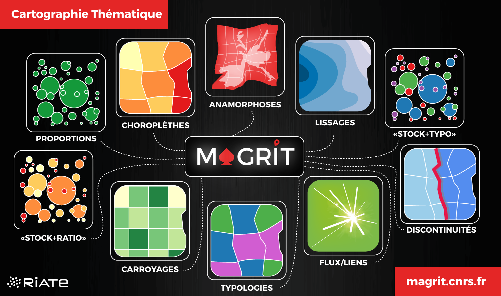

# [Magrit, un logiciel libre de cartographie en ligne](http://rcarto.github.io/magrit_mate/)
*Timothée Giraud*

Presentation de [Magrit](http://magrit.cnrs.fr) au séminaire de méthodes [Tuto@Mate]((https://mate-shs.cnrs.fr/actions/tutomate/tuto36-magrit-timothee-giraud/)) le 14 septembre 2021.

Magrit permet de réaliser une grande variété de représentations telles que les classiques cartes de symboles proportionnels ou choroplèthes. Il est aussi possible de construire des représentations plus originales mettant en œuvre des méthodes de lissage, de carroyage ou d’anamorphose. L’interface de l’application se veut simple et claire, elle est conçue pour guider l’utilisateur dans les principales étapes de réalisation d’une carte (import, choix de représentation, paramétrage, habillage et export).  
Ce webinar permet de découvrir les différentes fonctionnalités de ce logiciel libre, et de le prendre en main. À recommander, en particulier à ceux d’entre vous qui souhaitent utiliser un outil simple pour faire des cartes de qualité ou enseigner la cartographie thématique.

* [La présentation](http://rcarto.github.io/magrit_mate/)
* [Magrit](http://magrit.cnrs.fr)
* [Les Tuto@Mate](https://mate-shs.cnrs.fr/actions/tutomate/)

