```{r setup, include=FALSE}
knitr::opts_chunk$set(echo = TRUE)
```


## Une application de cartographie thématique

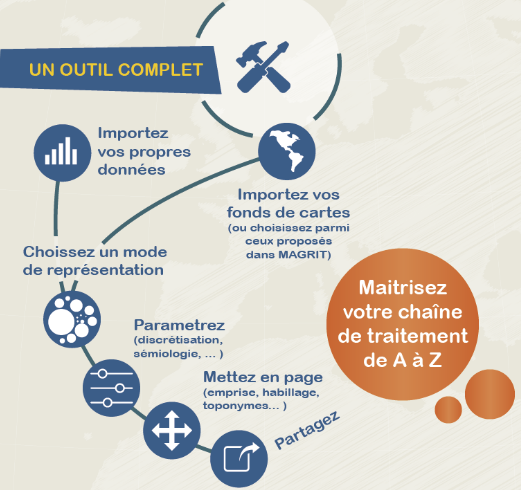

## Une application de cartographie thématique

### Magrit a été conçu pour l'enseignement de la cartographie. 
### Magrit est adapté à une utilisation professionnelle. 
### Magrit est compatible avec d'autres outils (interopérabilité).
### La prise en main de l'application est simple.

## 

<center> 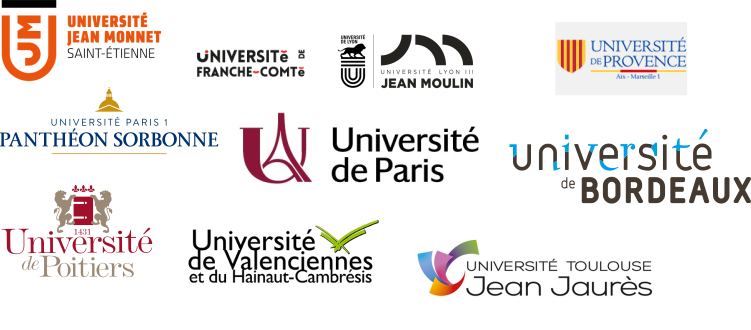 </center>

## Des représentations classiques

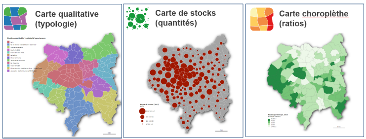

## Des représentations combinées

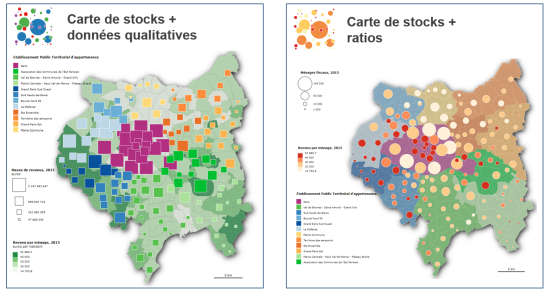


## Des représentations "avancées"

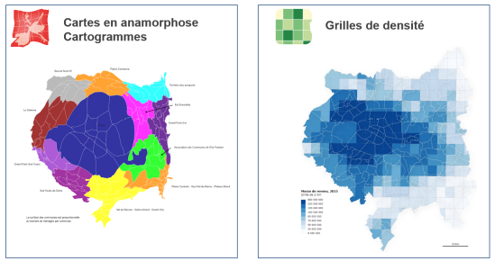

## Des représentations "avancées"

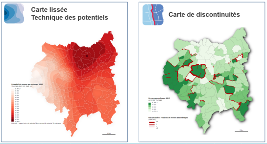


## Une application libre
Magrit est un projet libre sous licence CeCILL.   

  
**Ce**a **C**NRS **I**nria **L**ogiciel **L**ibre  <font size="2">https://cecill.info/</font>  

Ouvert aux contributions, son code source est disponible sur [GitHub](https://github.com/riatelab/magrit).   

[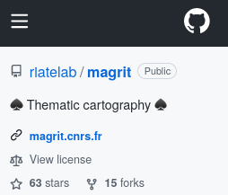](https://github.com/riatelab/magrit)  


## Une application en ligne
Magrit s'utilise **directement dans le navigateur** (Firefox, Chrome, Opera...) et donc avec n'importe quel système d'exploitation (Linux, Windows, macOS...). 

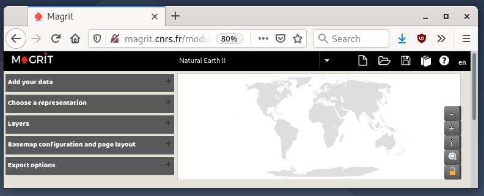

## Autour de Magrit
Magrit dispose d'une [documentation complète](http://magrit.cnrs.fr/docs/) en français.  

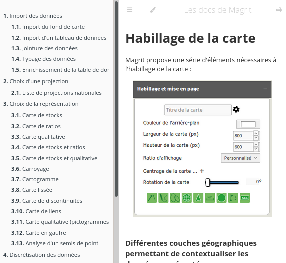

## Autour de Magrit
Un [carnet de recherche](https://magrit.hypotheses.org/) sur la plateforme hypotheses.  

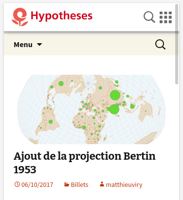


## Une application multilingue
Magrit est disponible en français, en anglais et en espagnol.   

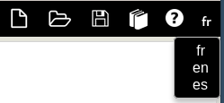


## La chaîne de traitement

Les menus de l'application suivent les étapes d'une chaine de traitement de l'information géographique

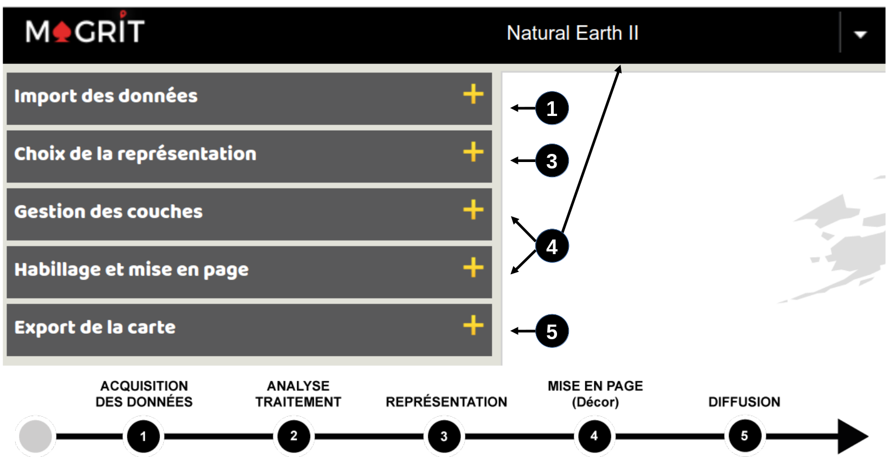  

## Import des données

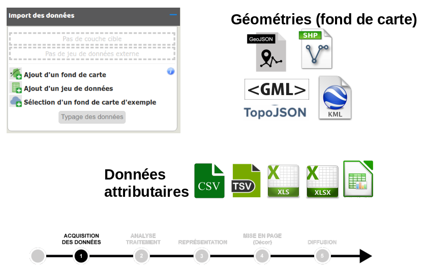  


## Typage des données 
Le typage des données détermine les choix de représentations cartographiques. 

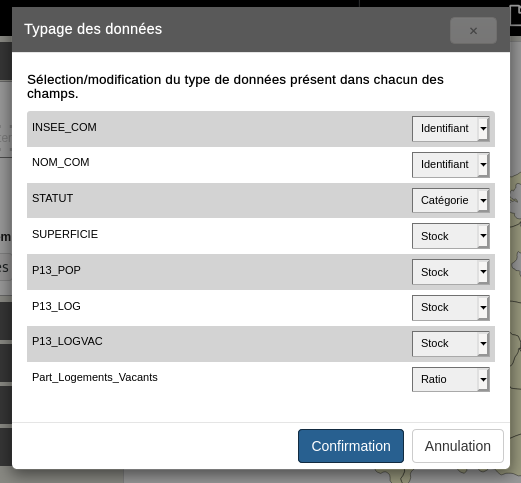

## Typage des données 
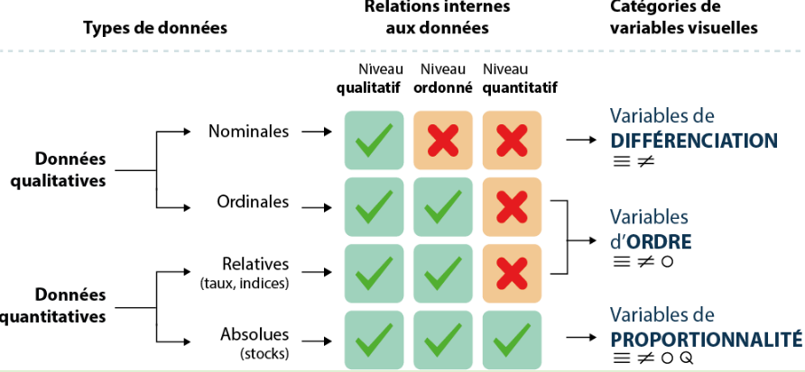


## Traitements, analyses

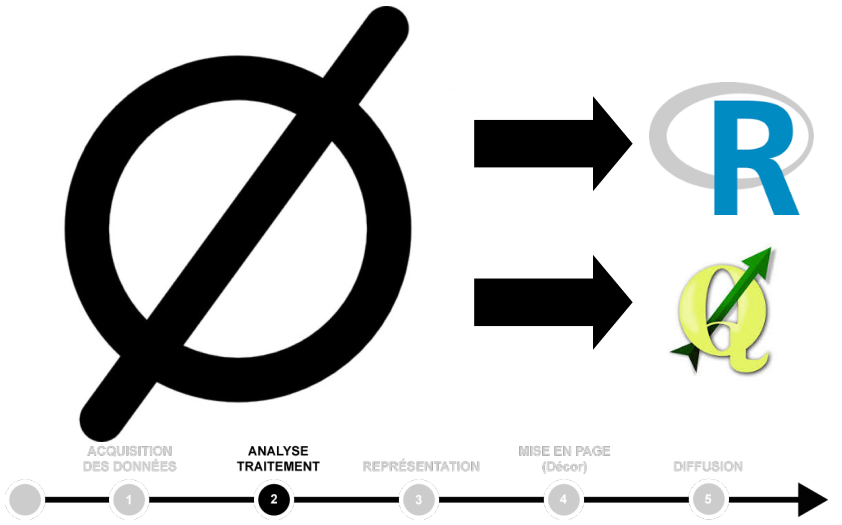


## Représentation

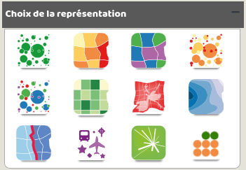


## {data-background=img/i1.png data-background-size=768px}

## {data-background=img/i2.png data-background-size=768px}

## {data-background=img/i3.png data-background-size=768px}

## {data-background=img/i4.png data-background-size=768px}

## {data-background=img/i5.png data-background-size=contain}

## {data-background=img/i6.png data-background-size=800px}

## {data-background=img/i7.png data-background-size=768px}

## {data-background=img/i8.png data-background-size=768px}

## {data-background=img/i9.png data-background-size=800px}

## Mise en page

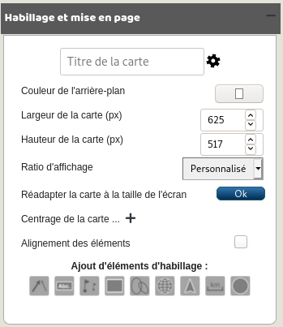
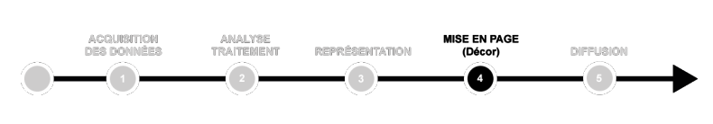

## Mise en page

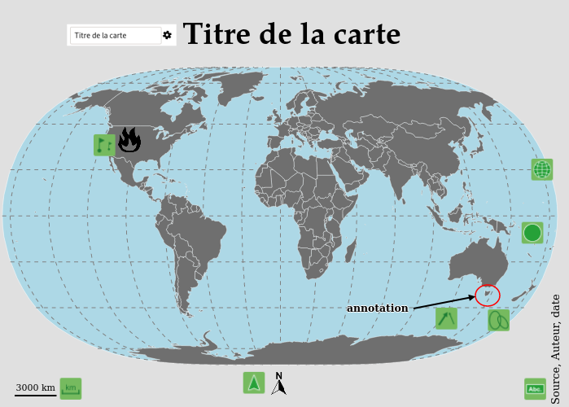

## Export
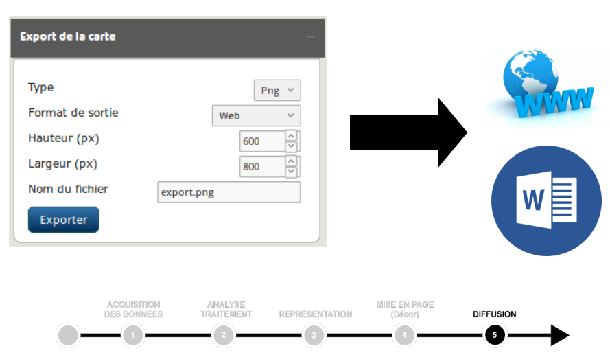

## Export
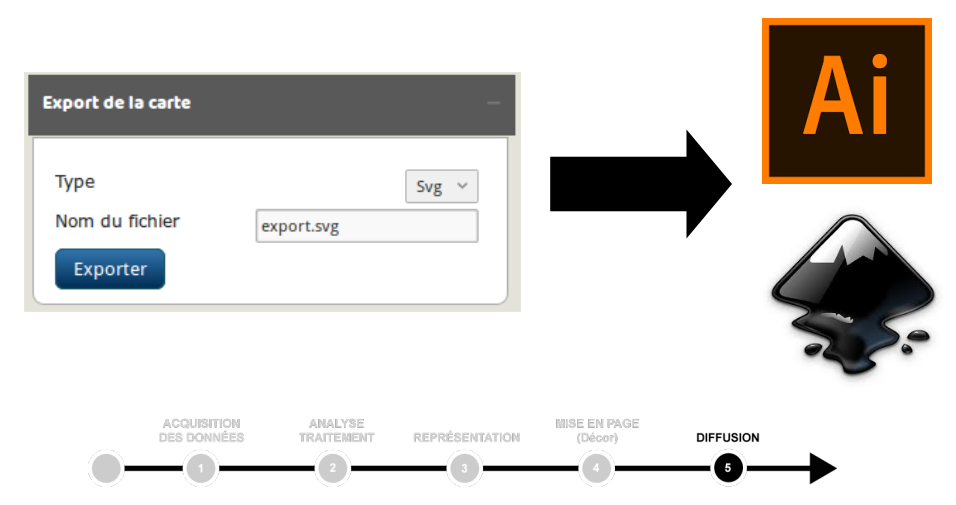

## Export
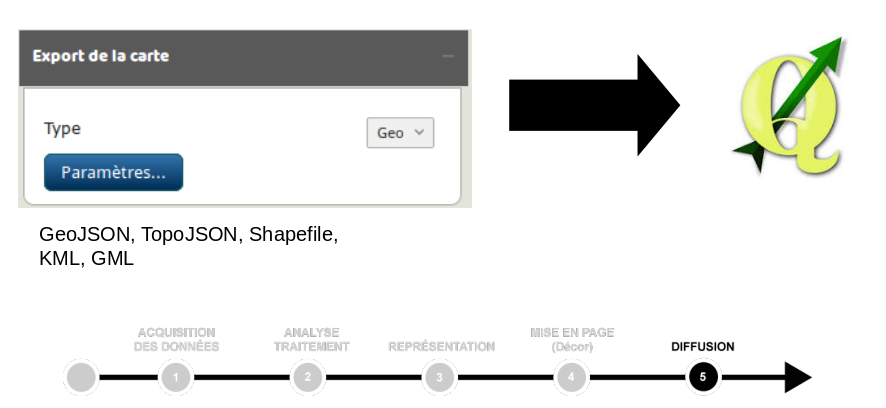

## Export
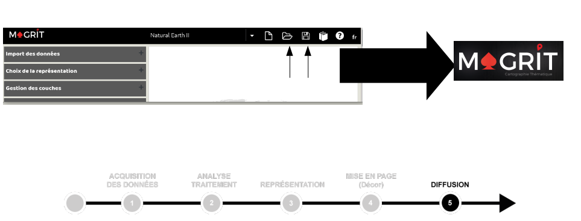

## À vous !
</br></br>
<center>
[](http://magrit.cnrs.fr)
</br>
[magrit.cnrs.fr](htpp://magrit.cnrs.fr)
</center>
</br>
 [github.com/riatelab/magrit](https://github.com/riatelab/magrit)         
 [rcarto.github.io/magrit_mate](https://rcarto.github.io/magrit_mate/)  
 [rgeomatic.hypotheses.org](https://rgeomatic.hypotheses.org/)  
 [\@rgeomatic](http://twitter.com/rgeomatic)    


## Bibliophie indicative 
<div class="columns-2">
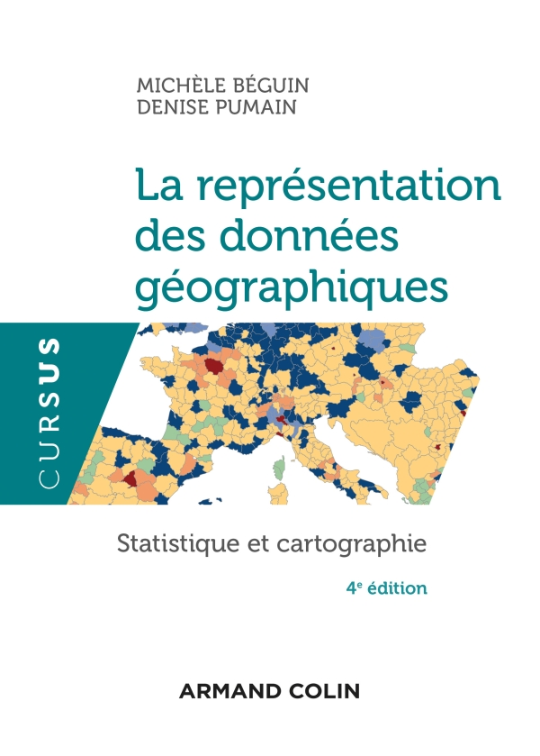  
BEGUIN Michèle, PUMAIN Denise  
**La représentation des données géographiques, Statistique et cartographie**,  
col. Cursus, Armand Colin, 2014.

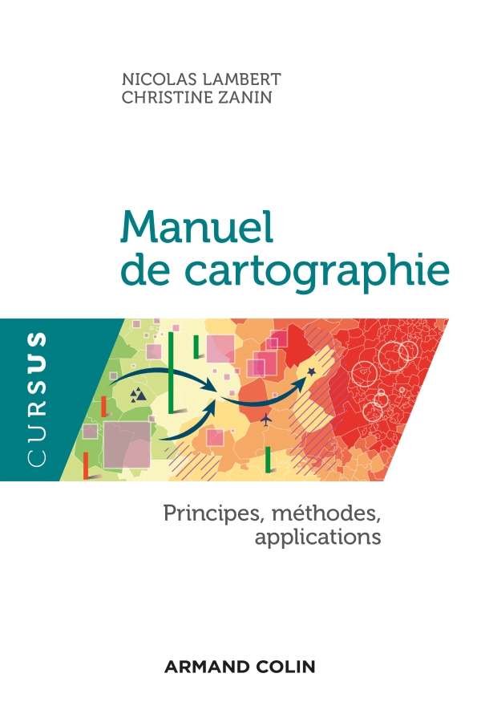   
LAMBERT Nicolas, ZANIN Christine
**Manuel de cartographie. Principes méthodes, applications**,   
col. Cursus, Armand Colin, 2016.

</div>